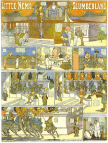

# Little Nemo Public-Domain Comic Before and After

This public-safe sample uses a public-domain `Little Nemo in Slumberland` page from Internet Archive.

## Before

Source page image:

## After

Chronicle accessible HTML output:

[Open Chronicle's accessible HTML result](little_nemo_chronicle_after.html)

## What Chronicle Adds

- a primary page heading
- panel-level navigation
- image descriptions for panel action and setting
- readable dialogue and caption flow
- semantic HTML suitable for screen-reader review

## Source

Internet Archive collection:

https://archive.org/details/LittleNemo1905-1914ByWinsorMccay
